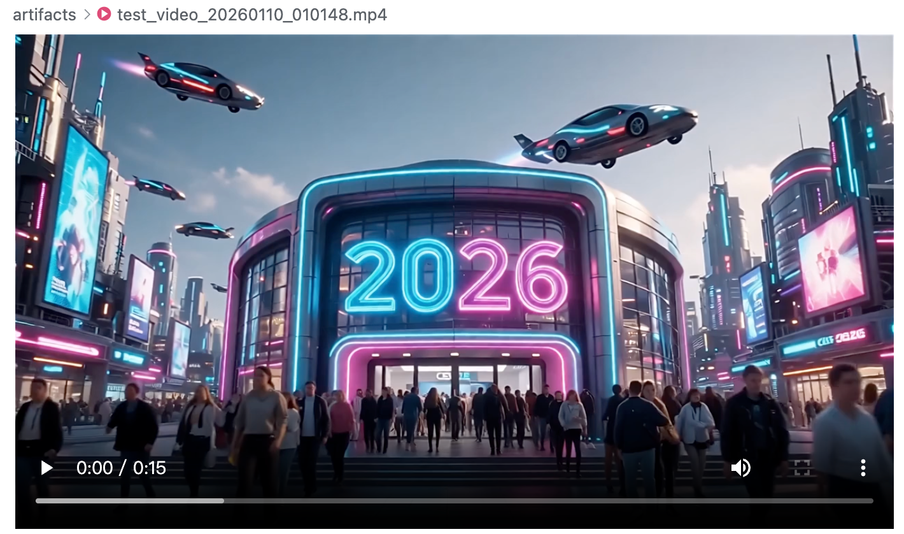
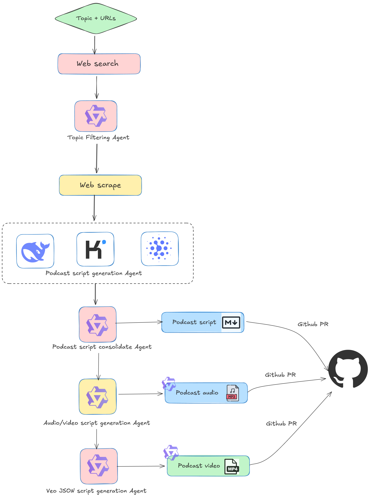

# Podcast Generation Workflow

一个基于AI的自动化播客生成系统，能够从新闻源获取内容，自动生成播客脚本、音频和视频，并发布到GitHub仓库。



## 功能特性

- **多智能体架构**：基于OpenAI Agents SDK构建的multi-agent系统，实现任务分工与协作
- **内容获取**：从RSS新闻源搜索与指定主题相关的内容
- **智能过滤**：使用AI过滤相关内容，确保主题相关性
- **多模型生成**：支持使用多种AI模型（Deepseek、Kimi、GLM等）生成播客脚本
- **内容整合**：通过推理代理整合不同模型的输出，生成高质量的综合脚本
- **多媒体生成**：自动生成播客音频和视频内容
- **文件保存**：将生成的脚本、音频和视频保存到本地文件系统
- **GitHub集成**：自动创建GitHub PR，发布生成的播客内容

## 项目结构

```
podcast-workflow-new/
├── prompts/               # AI提示文件目录
│   ├── topic_filtering_agent.txt           # 主题过滤代理提示
│   ├── podcast_generation_agent.txt        # 播客生成代理提示
│   ├── podcast_generation_reasoning_agent.txt  # 播客推理代理提示
│   ├── video_script_generation_agent.txt   # 视频脚本生成代理提示
│   ├── veo_json_builder_agent.txt          # VEO JSON构建代理提示
│   └── github_pr_agent.txt                 # GitHub PR代理提示
├── workflow.py            # 主工作流脚本
├── tools.py               # 工具函数集
├── config.py              # 配置文件
├── logging_utils.py       # 日志工具
├── requirements.txt       # 依赖列表
├── pyproject.toml         # 项目元数据
├── artifacts/             # 生成的内容存储目录
└── README.md              # 项目说明文档
```

## 系统架构图



## 数据流说明

本项目基于[OpenAI Agents SDK](https://github.com/openai/openai-agents-python)构建了一个完整的多智能体(multi-agent)系统，各代理间通过明确的任务分工和协作完成播客生成的全流程：

1. **内容获取阶段**
   - 从RSS新闻源获取原始内容
   - **主题过滤代理**（基于DashScope模型）筛选相关内容，确保主题相关性
   - 内容提取工具提取并清理主要内容

2. **播客生成阶段**
   - **多模型并行生成**：Deepseek、Kimi、GLM等模型的播客生成代理并行工作
   - **推理代理**整合不同模型的输出，生成高质量的综合脚本

3. **多媒体生成阶段**
   - **视频脚本生成代理**基于综合脚本创建视频分镜脚本
   - **VEO JSON构建代理**生成视频生成所需的VEO JSON配置
   - 调用DashScope API生成视频和音频

4. **发布阶段**
   - 保存所有生成的内容到本地文件系统
   - 通过GitHub PR工具自动创建GitHub PR，发布生成的播客内容

## 安装要求

- Python 3.10+
- 相关API密钥（Deepseek、DashScope、MoonShot/Kimi、GitHub等）

## 安装步骤

1. **克隆仓库**
   ```bash
   git clone <repository-url>
   cd podcast-workflow-new
   ```

2. **创建虚拟环境**
   ```bash
   python3 -m venv .venv
   source .venv/bin/activate
   ```

3. **安装依赖**
   ```bash
   pip install -r requirements.txt
   ```

4. **配置环境变量**
   创建`.env`文件并添加所需的API密钥：
   ```
   # Deepseek API
   DEEPSEEK_MODEL_NAME="deepseek-chat"
   DEEPSEEK_API_KEY="your-deepseek-api-key"
   DEEPSEEK_BASE_URL="https://api.deepseek.com/v1"
   
   # DashScope API
   DASHSCOPE_MODEL_NAME="qwen-turbo"
   DASHSCOPE_API_KEY="your-dashscope-api-key"
   DASHSCOPE_BASE_URL="https://dashscope.aliyuncs.com/compatible-mode/v1"
   
   # MoonShot/Kimi API
   MOONSHOT_MODEL_NAME="moonshot-v1-8k"
   MOONSHOT_API_KEY="your-moonshot-api-key"
   MOONSHOT_BASE_URL="https://api.moonshot.cn/v1"
   
   # GitHub API
   GITHUB_TOKEN="your-github-token"
   GITHUB_REPO="your-username/repository"
   ```

## 使用方法

### 基本使用

直接运行工作流脚本：

```bash
python workflow.py
```

### 自定义配置

在`workflow.py`的`if __name__ == "__main__":`部分修改参数：

```python
topic = "CES 2026"           # 播客主题
days = 7                     # 搜索过去几天的内容
# 不提供urls参数时，系统将自动使用Google News搜索RSS feed
asyncio.run(run_workflow(topic=topic, days=days))

# 或者手动指定新闻源URLs
# urls = ["https://news.google.com/"]  # 新闻源列表
# asyncio.run(run_workflow(topic=topic, days=days, urls=urls))
```

## 工作流程

1. **内容搜索**：自动使用Google News搜索RSS feed获取与主题相关的内容（或从指定的新闻源搜索）
2. **主题过滤**：使用AI过滤相关内容，确保主题相关性
3. **内容提取**：从过滤后的URL中提取主要内容
4. **脚本生成**：使用多个AI模型（Deepseek、Kimi、GLM）并行生成播客脚本
5. **内容整合**：通过推理代理整合不同模型的输出，生成高质量的综合脚本
6. **保存脚本**：将综合脚本保存到artifacts目录
7. **音频/视频脚本生成**：基于综合脚本生成音频、视频脚本
8. **VEO JSON构建**：生成视频生成所需的VEO JSON配置
9. **视频生成**：调用DashScope API生成视频并保存到artifacts目录
10. **音频生成**：调用DashScope API生成音频并保存到artifacts目录
11. **GitHub发布**：创建GitHub PR发布生成的内容

## 生成的文件

所有生成的内容都保存在项目根目录下的`artifacts/`目录中：

- **播客脚本**：`artifacts/podcast_text_{datetime}.md`
- **播客音频**：`artifacts/podcast_audio_{datetime}.mp3`
- **播客视频**：`artifacts/podcast_video_{datetime}.mp4`

## 配置说明

### 模型配置

在`config.py`中配置不同AI模型的参数：

- **Deepseek**：主要用于播客脚本生成和推理
- **DashScope**：用于主题过滤、视频、音频脚本生成和多媒体创建
- **MoonShot/Kimi**：用于播客脚本生成
- **GLM**：用于播客脚本生成（可选）

### 日志配置

日志配置在`logging_utils.py`中，默认记录INFO级别以上的日志。

## 扩展与定制

### 添加新的AI模型

1. 在`config.py`中添加模型配置
2. 在`workflow.py`中创建相应的代理实例
3. 在工作流程中集成新的模型生成步骤

### 修改提示模板

修改`prompts/`目录下的相应提示文件，自定义AI代理的行为。

## 故障排除

### 常见问题

1. **API连接错误**：检查API密钥和网络连接
2. **内容过滤为空**：尝试调整搜索主题或增加搜索天数
3. **多媒体生成失败**：检查DashScope API配额和参数配置
4. **GitHub PR失败**：检查GitHub令牌权限和仓库配置

## 许可证

MIT License

## 贡献

欢迎提交Issue和Pull Request！
